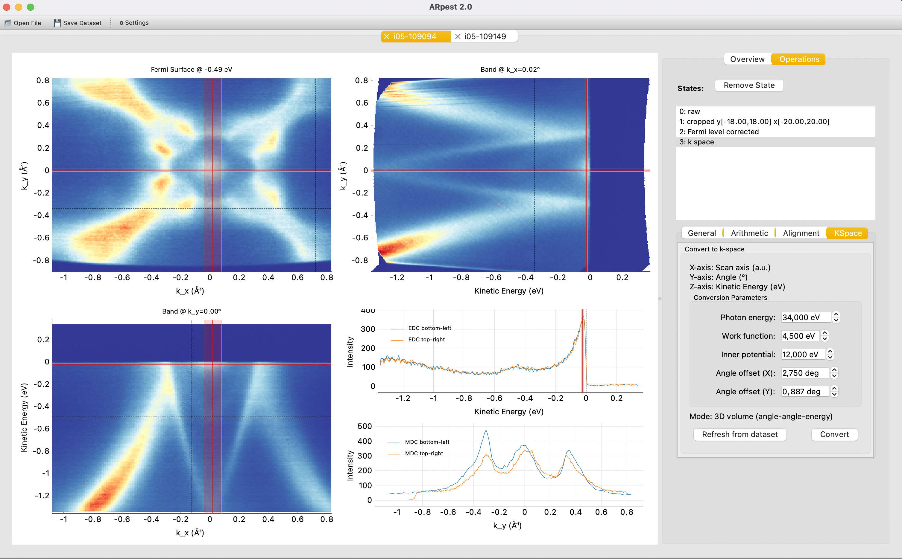

# ARpest

**A**ngle-**R**esolved **P**hotoemission **E**lectron **S**pectroscopy **T**ool

A modern, interactive Python application for analysing ARPES (Angle-Resolved Photoemission Spectroscopy) data from multiple synchrotron beamlines.


## Features

### Core Capabilities
- **Multi-beamline support**: Load data from Diamond Light Source (I05) and MAX IV (Bloch)
- **Multiple file formats**: `.nxs`, `.h5`, `.zip`, `.ibw`
- **2D & 3D visualisation**: Single cuts and photon energy/deflector angle scans
- **Interactive analysis**: Real-time cursor tracking with live EDC/MDC updates
- **State management**: Undo/redo functionality with complete processing history
- **Tabbed interface**: Work with multiple datasets simultaneously
- **Save a session**: Save and comeback where you where

### Performance
- Optimized and rendering for smooth visualisation
- Fast numpy slicing for data extraction
- In-place data updates (no memory reallocation)
- Efficient rendering for large datasets

---

## Installation

### Requirements
- Python 3.9 or higher
- PyQt5
- NumPy
- Matplotlib
- SciPy
- h5py
- igor (optional, for `.ibw` files)
- pyqtgraph

### Quick Install

```bash
# Clone the repository
git clone https://github.com/OlaKenji/ARpest.git
cd arpest

# Install dependencies
pip install PyQt5 numpy matplotlib scipy h5py igor, pyqtgraph

# Run the application
python run.py
```

## Usage

### Basic Workflow

1. **Launch the application**:
   ```bash
   python run.py
   ```

2. **Load data**:
   - Click the 📂 **Open File** button in the toolbar
   - Select your ARPES data file (`.nxs`, `.h5`, `.zip`, or `.ibw`)

3. **Interactive analysis**:
   - **Move mouse**: Gray dashed crosshair follows cursor
   - **Click**: Red solid lines mark cut position, EDC/MDC update
   - **Click & drag**: Continuously update cuts in real-time
   - **3D data**: Use energy slider to navigate through different energy slices

4. **Configure settings**:
   - Click ⚙️ **Settings** to set default data directory
   - Choose preferred colormap
   - Settings persist between sessions

### Supported Beamlines

#### Diamond Light Source - I05
- **File format**: `.nxs`, `.h5` (HDF5)
- **Data types**: 
  - 2D single cuts
  - 3D deflector angle scans
  - 3D photon energy scans
- **Metadata**: Automatically extracts photon energy, tilt angles, temperature

#### MAX IV - Bloch
- **File formats**: `.zip`, `.ibw`
- **Data types**:
  - 2D single cuts (`.ibw`, `.zip`)
  - 3D photon energy scans (`.ibw`)
  - 3D Fermi surface maps (`.zip`)
- **Metadata**: Extracts scan parameters from viewer.ini and IBW headers

## Data Model
ARpest uses a unified data structure for all beamlines:

```python
@dataclass
class Dataset:
    """Unified ARPES dataset representation"""
    x_axis: Axis          # Typically angle or energy
    y_axis: Axis          # Typically energy or angle
    intensity: np.ndarray # 2D, 3D, or 4D intensity data
    z_axis: Optional[Axis] = None  # For 3D data (photon energy, etc.)
    w_axis: Optional[Axis] = None  # For 4D data
    measurement: Measurement = field(default_factory=Measurement)
    filename: str = ""
```

This design allows:
- Consistent processing across different beamlines
- Easy addition of new data loaders
- Type-safe operations with proper validation

---

## Key Features in Detail

### State Management
Every operation creates a new state that can be restored:

```python
file_stack = FileStack(
    filename="my_data.nxs",
    raw_data=dataset,  # Original data (never modified)
)

# After processing
file_stack.add_state(processed_dataset, "normalized")
file_stack.add_state(further_processed, "fermi_aligned")

```

### Extensible Loader System
Adding a new beamline is straightforward:

```python
class MyBeamlineLoader(BaseLoader):
    def can_load(self, filepath: Path) -> bool:
        # Check if file is from this beamline
        return filepath.suffix == ".xyz" and self._check_format(filepath)
    
    def load(self, filepath: Path) -> Dataset:
        # Load and return unified Dataset
        return Dataset(x_axis=..., y_axis=..., intensity=...)
```

## Roadmap

- [ ] Additional beamline support (SLS, SOLEIL, etc.)
- [ ] Data processing operations (normalization, Fermi level alignment)
- [ ] Export processed data
- [ ] Batch processing capabilities
- [ ] Analysis plugins system

---
## Contributing

Contributions are welcome! Please:

1. Fork the repository
2. Create a feature branch (`git checkout -b feature/amazing-feature`)
3. Commit your changes (`git commit -m 'Add amazing feature'`)
4. Push to the branch (`git push origin feature/amazing-feature`)
5. Open a Pull Request

---
## License

This project is licensed under the MIT License - see the LICENSE file for details.

---
## Citation

If you use ARpest in your research, please cite:

```bibtex
@software{arpest2025,
  author = {Ola Kenji Forslund},
  title = {ARpest: Interactive ARPES Data Analysis Tool},
  year = {2025},
  url = {https://github.com/OlaKenji/arpest}
}
```

---
## Contact

- **Issues**: [GitHub Issues](https://github.com/OlaKenji/arpest/issues)
- **Discussions**: [GitHub Discussions](https://github.com/OlaKenji/arpest/discussions)

---
## Screenshots

### 2D Single Cut Analysis

*Interactive band structure visualization with EDC and MDC*

### 3D Fermi Surface Mapping

*Fermi surface with momentum cuts*

---